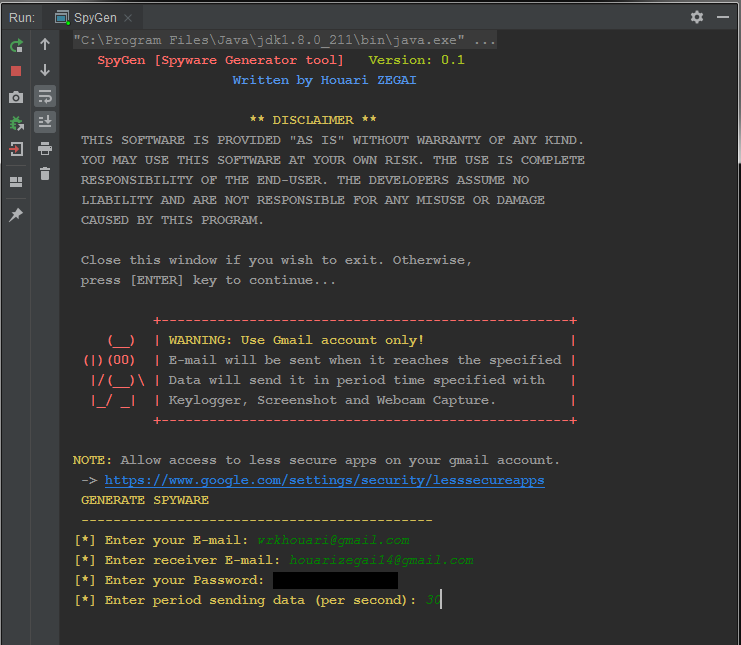
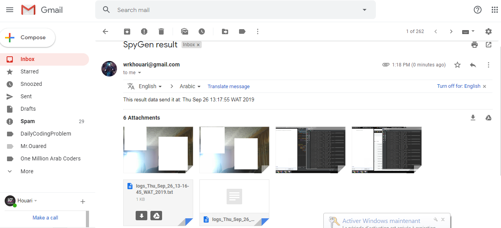

<h1 align="center">SypGen</h1>

  
  
  

  :computer: SpyGen is a Spyware Generator for Windows systems.

### Disclaimer
This project was created only for good purposes and personal use.
This project should be used for authorized testing or educational purposes only. The author and anyone affiliated with will not be liable for any losses and/or damages in connection with use of ANY files provided in this repository.

### Features
- [x] Keylogger
- [x] Take Screenshot
- [x] Webcam Capture

### Screenshots
Console (app)          |
:---------------------:|
 |
Email (data sent)           |
 |

### Requirements
* Java version 8 or higher.
* Internet connection (for sending data).

### How To Use
1. Press the **fork** button (top-right the page) 
2. Download the repository files (project) from the download section or clone this project by typing in the bash the following command:

       git clone https://github.com/HouariZegai/SpyGen.git
3. Open it in Intellij IDEA and let maven download used libraries for you.
4. Run the application :D

### Contributing
If you want to contribute to this project and make it better with new ideas, your pull request is very welcomed.
If you find any issue just put it in the repository issue section, thank you.

### About
Made with :heart: and Java by Houari ZEGAI.